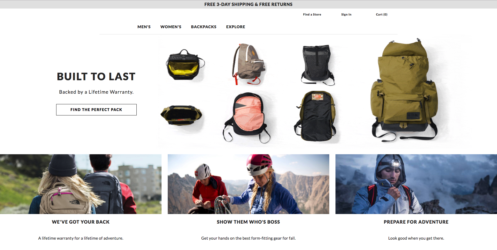

OVERVIEW

<a href="https://thenorthfacebydave.com">TheNorthFaceByDave</a> is an e-commerce site clone of https://www.thenorthface.com. Similar to consumers visiting TheNorthFace.com to find high-quality gear for their next great adventure, I too utilized high quality gear to create this functional, fully-responsive, full-stack website. That gear includes React with Redux, ES6, and CSS on the front-end. As well as Node, Express, Massive, and PostgreSQL to create and interact with my server and database, which holds over 300 entries, on the back-end. Additionally, I utilized RESTful APIs to interact with data between the front- and back-ends and brought in Stripe for secure credit-card transactions.

MAJOR TECHNOLOGIES

  <ul>
    <li>React with Redux</li>
    <li>JavaScript (ES6)</li>
    <li>CSS3 with Flexbox & Media Queries</li>
    <li>RESTful API requests</li>
    <li>Node</li>
    <li>Express</li>
    <li>Massive</li>
    <li>PostgreSQL</li>
    <li>Stripe</li>
  </ul>
