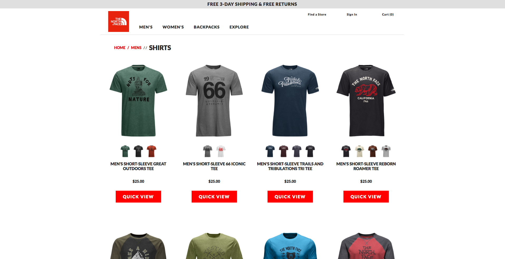
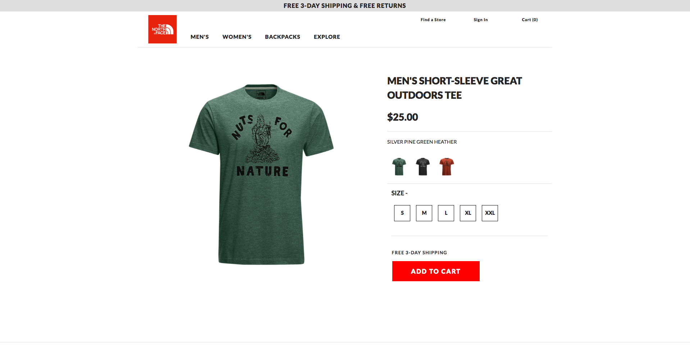
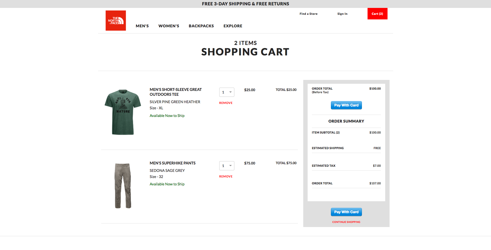

OVERVIEW

<a href="https://thenorthfacebydave.now.sh">TheNorthFaceByDave</a> is an e-commerce site clone of https://www.thenorthface.com, which I built from scratch in two-weeks. Similar to consumers visiting TheNorthFace.com to find high-quality gear for their next great adventure, I too utilized high quality gear to create this functional, fully-responsive, full-stack website. That gear includes React with Redux, ES6, and CSS on the front-end. As well as Node, Express, Massive, and PostgreSQL to create and interact with my server and database, which holds over 300 entries, on the back-end. Additionally, I utilized RESTful APIs to interact with data between the front- and back-ends and brought in Stripe for secure credit-card transactions.

MAJOR TECHNOLOGIES

  <ul>
    <li>React with Redux</li>
    <li>JavaScript (ES6)</li>
    <li>CSS3 with Flexbox & Media Queries</li>
    <li>RESTful API requests</li>
    <li>Node</li>
    <li>Express</li>
    <li>Massive</li>
    <li>PostgreSQL</li>
    <li>Stripe</li>
  </ul>

  

RENDERING 300+ PRODUCTS FROM DATABASE

I utilized nested browser routing with params to render the 300+ products in my database on what might like multiple unique pages, but is actually actually one single and versatile component. In conjunction with incorporating RESTful API requests, this unique product component displays products categorized by both gender and product-type.

COLOR SWAPPING WITH REDUX

To increase user experience, I built in color-swapping functionality which leverages Redux to allow for a consumer to view each product in all available colors, and, when navigating to a quick view for that product, to immediately see the selected product color and product information when the component loads, with the added ability to update my preferences without navigating back.

I can click on the same product again, which will update the quantity of that product rather than adding an identical item to my cart, or I can change either the size, color, or both to add a unique product instance to my cart in addition to the original product I previously added.

FULLY FUNCTIONAL CART WITH SECURE STRIPE TRANSACTIONS

Finally, as a result of using Redux, I can view my product purchase information, update product quantities, and remove items from my cart which updates the purchase information in real time.

Once I’m ready to check out, I, as the user, can click on the Stripe checkout button, input my information, and process a secure financial transaction which will then show up in my Stripe dashboard.

DISCLAIMER

TheNorthFaceByDave is a non-commercial personal project meant to be a prototype for future e-commerce solutions. This project was used to develop and demonstrate full-stack concepts using responsive-design.
